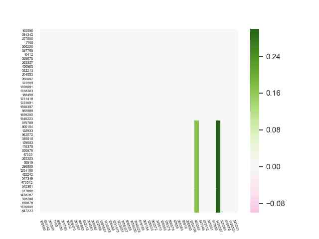
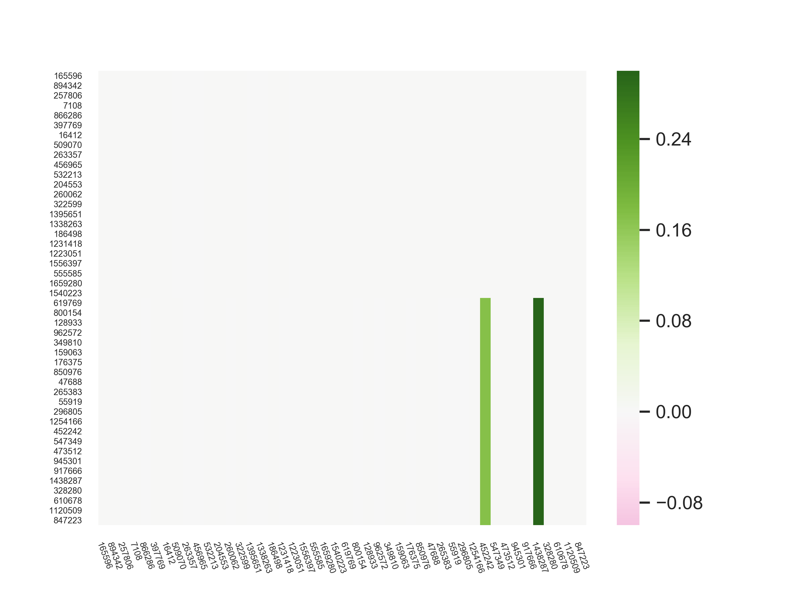
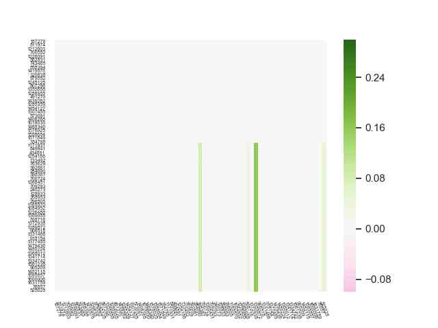
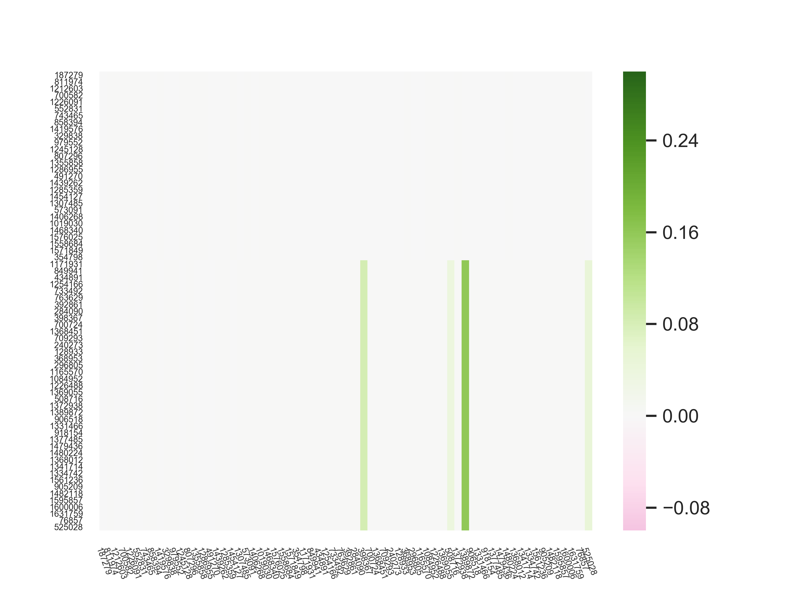

[](http://quantlet.de/)

## [](http://quantlet.de/) **SoNIC_AAPL_BTC** [](http://quantlet.de/)

```yaml

Name of Quantlet:  SoNIC_AAPL_BTC   

Published in: SoNIC

Description: 'estimation of SoNIC model on AAPL and BTC sentiment weights'

Keywords:
- social network
- network autoregression
- clustering
- communities
- influencer
- central node
- sentiment analysis
- stocktwits
- adjacency matrix
- lasso
- greedy algorithm
- Apple
- Bitcoin

See also: 
- SoNIC_simulation_study
- SoNIC_AAPL_BTC_stability

Author: Yegor Klochkov

Submitted: Mon, Jun 17 2019 by Yegor Klochkov
```









### PYTHON Code
```python

import common.read_data as read_data
import common.missing as missing
import numpy as np
import matplotlib.pyplot as plt
import seaborn as sns

from common.alternating import matrix_competition

if __name__ == '__main__':
    tasks = [
        ('../data/users_daily_timeseries_AAPL.csv', "theta_daily_AAPL")
        , ('../data/users_BTC_timeseries_Daily.csv', "theta_daily_BTC")
    ]

    for task in tasks:
        data_path, save_path = task

        Y, deltas, names = read_data.read_stock_twits_user_sentiment(data_path, min_days=50, min_delta=0.5)
        N, tmax = np.shape(Y)

        D0 = missing.missing_var(Y[:, :-1], deltas)
        D1 = missing.missing_covar(Y[:, :-1], Y[:, 1:], deltas, deltas)

        # SET NUMBER OF CLUSTERS
        num_clusters = 2

        lmbd = (np.linalg.eigvalsh(D0)[-(num_clusters + 1)]) * np.sqrt(np.log(N)) / np.sqrt(tmax * np.min(deltas) ** 2)
        print("lambda={}".format(lmbd))

        res = matrix_competition('ALTER', 5, num_clusters, D0, D1, lmbd, epochs=50)
        theta_est, v_est, u_est, ind_est, loss = res.theta, res.v, res.u, res.index, res.loss

        lists = [[] for i in range(num_clusters)]
        for i in range(N):
            lists[res.index[i]].append(i)

        rearrange = []
        for j in range(num_clusters):
            rearrange += lists[j]
        theta_sort = theta_est[rearrange].T
        theta_sort = theta_sort[rearrange].T

        plt.figure()
        sns.set()
        ax = sns.heatmap(theta_sort, center=0, xticklabels=names[rearrange], yticklabels=names[rearrange], cmap="PiYG", vmin=-0.1, vmax = 0.3)
        ax.set_xticklabels(ax.get_xticklabels(), rotation=-70, fontsize=5)
        ax.set_yticklabels(ax.get_yticklabels(), rotation=0, fontsize=5)
        plt.savefig(save_path + ".png", dpi=500)
        plt.savefig(save_path + ".jpg", dpi=100, optimize=True, quality=30)
        plt.clf()


```

automatically created on 2020-04-27