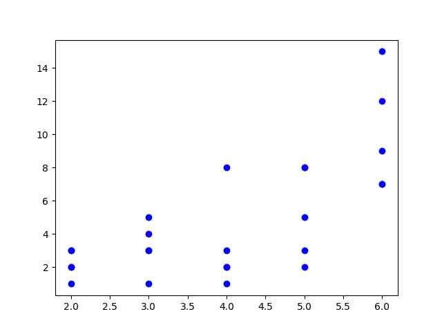
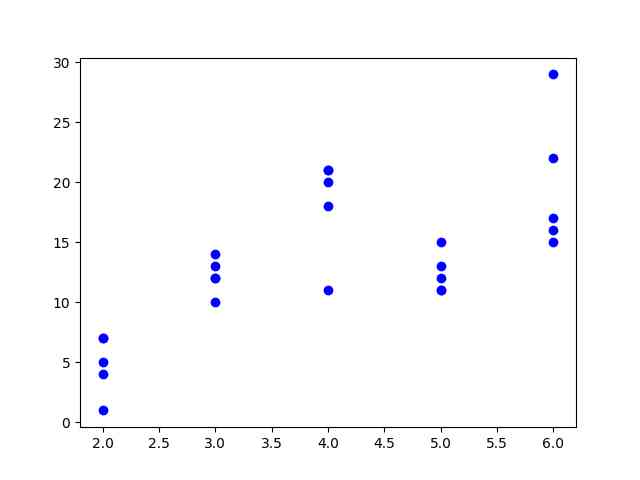

[](http://quantlet.de/)

## [](http://quantlet.de/) **SoNIC_AAPL_BTC_stability** [](http://quantlet.de/)

```yaml

Name of Quantlet:  SoNIC_AAPL_BTC_stability   

Published in: SoNIC

Description: 'stability analysis and choice of the number of clustering of SoNIC model on AAPL and BTC sentiment weights'

Keywords:
- social network
- network autoregression
- clustering
- communities
- influencer
- central node
- sentiment analysis
- stocktwits
- adjacency matrix
- lasso
- greedy algorithm
- Apple
- Bitcoin

See also: 
- SoNIC_simulation_study
- SoNIC_AAPL_BTC

Author: Yegor Klochkov

Submitted: Mon, Jun 17 2019 by Yegor Klochkov
```







### PYTHON Code
```python

import common.read_data as read_data
import common.missing as missing
from pandas import read_csv, DataFrame
import numpy as np
import matplotlib.pyplot as plt
import seaborn as sns
from sklearn import cluster

from common.alternating import matrix_competition, index_dist


def generate_random_weights(num):
    # SHOULD ONLY BE APPLIED IN MAIN PROCESS!
    #
    # let p > q and p + q = 1 then P(X = 1 - \sqrt{q/p}) = p and P(X = 1 + \sqrt{p/q}) = q
    # ensures that E(X) = 1 and Var(X) = 1 and X > 0 a.s.
    # moreover, taking p = 4/5 and q = 1/5 we have X \in [1 - 1/2, 1 + 2] = [0.5, 3]
    #

    def trans(x):
        if x < .8:
            return 0.5
        else:
            return 3.0
    return np.vectorize(trans)(np.random.rand(num))


if __name__ == '__main__':
    tasks = [
        ('../data/users_daily_timeseries_AAPL.csv', "adapt_AAPL")
        , ('../data/users_BTC_timeseries_Daily.csv', "adapt_BTC")
    ]

    for (data_path, save_path) in tasks:
        print(data_path)

        Y, deltas, names = read_data.read_stock_twits_user_sentiment(data_path, min_days=80, min_delta=.5)
        N, tmax = np.shape(Y)

        SIM_NUM = 6
        win_len = (3 * tmax) // 4

        c_nums = [2, 3, 4, 5, 6]

        ans_idx = []
        ans_theta = []
        ans_loss = []
        for c_num in c_nums:
            ress = []
            for (a, b) in [(k * ((tmax - win_len + 1) // SIM_NUM), k * ((tmax - win_len + 1) // SIM_NUM) + win_len) for k in range(SIM_NUM)]:

                x_train = Y[:, a:b-1]
                y_train = Y[:, a + 1:b]

                D0 = missing.missing_var(x_train, deltas)
                D1 = missing.missing_covar(x_train, y_train, deltas, deltas)

                lmbd = (np.linalg.eigvalsh(D0)[-(c_num + 1)]) * np.sqrt(np.log(N)) / np.sqrt(tmax * np.min(deltas) ** 2)
                ress.append(matrix_competition("ALTER", 5, c_num, D0, D1, lmbd, epochs=50))

            ans_idx.append([index_dist(c_num, ress[0].index, ress[j].index) for j in range(1, SIM_NUM)])
            ans_theta.append([np.linalg.norm(ress[0].theta - ress[j].theta) for j in range(1, SIM_NUM)])
            ans_loss.append(ress[0].loss)

        plt.figure()
        for i, c_num in enumerate(c_nums):
            plt.plot([c_num] * (SIM_NUM - 1), ans_idx[i], 'o', color='b')
        plt.savefig(save_path + ".png", dpi=500)
        plt.savefig(save_path + ".jpg", dpi=100, optimize=True, quality=30)
        plt.clf()


```

automatically created on 2020-04-27